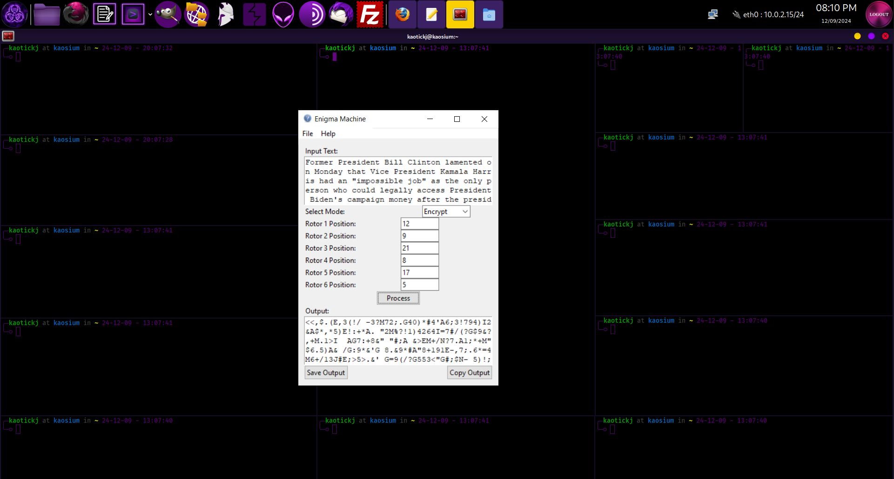

# Enigma Machine

This project is a Python-based implementation of the famous German Enigma Machine used during World War II for encrypting and decrypting messages. The machine works using rotors and a reflector to scramble and unscramble messages. This version uses additional rotors and keyed XOR encryption for extra security. The extra encryption measures assure that the ciphertext generated by this application is unbreakable.

## Features

- **Graphical User Interface (GUI)**: Created with `tkinter` to make it easy to interact with the Enigma Machine.
- **Rotor and Reflector Configuration**: Allows you to set up and change rotor positions and the reflector.
- **Encryption and Decryption**: Supports both encryption and decryption with a simple input and output field.
- **XOR Encryption**: Provides an additional XOR layer for further encoding or decoding the Enigma output.
- **File Operations**: Save and open encrypted/decrypted messages and rotor positions as text files.
- **Copy to Clipboard**: Copy the processed message to your clipboard for easy use.
- **Help and Information**: Includes sections about the Enigma machine's history and instructions for using the application.

## Installation

To run this project, download the zip file and extract the contents - or clone the repository - and run the exe file.

## Usage

1. **Input Text**: Enter the message you wish to encrypt or decrypt in the input text area.
2. **Set Rotor Positions**: Enter the rotor positions (between 0 and 25) for all six rotors. The same positions must be used for both encryption and decryption.
3. **Select Mode**: Choose either "Encrypt" or "Decrypt" from the dropdown menu.
4. **Process**: Click the "Process" button to encrypt or decrypt the message.
5. **Save Output**: Use the "Save Output" button to save the result to a file.
6. **Save As**: Use the "Save As" option under the File menu to save the result with a custom name.
7. **Copy Output**: The "Copy Output" button copies the result to your clipboard.
8. **Open File**: To load a saved file, click "Open" under the File menu. The input text and rotor positions will be loaded automatically.
9. **Help**: For additional information, use the "Help" menu to view the about section, history, and instructions.

### Example

1. Enter a message in the "Input Text" field (e.g., "HELLO").
2. Set the rotor positions (e.g., `1, 2, 3, 4, 5, 6`).
3. Choose the "Encrypt" mode and click "Process".
4. The encrypted text will appear in the "Output" section.

## License

This project is open source and available under the MIT License.

## Acknowledgments

- This project is based on the Enigma machine designed by Arthur Scherbius and used during World War II by the German military.
- The original Enigma machine's cryptographic security was considered unbreakable until it was famously cracked by the Allies, notably at Bletchley Park.

## Links

- [Enigma Wikipedia](https://en.wikipedia.org/wiki/Enigma_machine)
- [BBC History of Enigma](https://www.bbc.co.uk/history/worldwars/wwtwo/enigma_01.shtml)

## Contact

Created by [Kaotick Jay](https://github.com/kaotickj).
